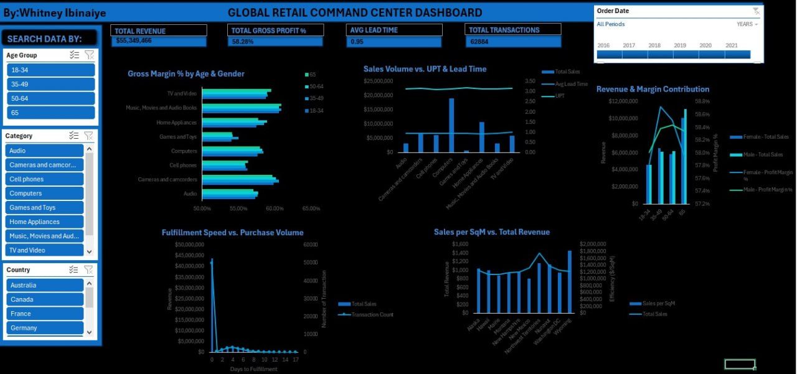

# Global-Retail-Command-Center-Dashboard-
Interactive Retail Analytics Dashboard built in Microsoft Excel using Power Query, Power Pivot, and DAX to analyze revenue, profitability, customer demographics, and operational efficiency across global retail markets.
   
**Project Type:** Business Intelligence / Retail Analytics  

---

#  Project Overview

Retail organizations generate large amounts of transactional data across multiple countries, customer segments, and product categories. However, without a centralized reporting system, it becomes difficult for decision-makers to quickly evaluate business performance.

This project develops an **interactive Retail Command Center Dashboard** that consolidates key retail metrics into a single analytical view. The dashboard enables stakeholders to monitor revenue performance, profitability, operational efficiency, and customer behavior across different markets.

The solution was built using **Microsoft Excel with Power Query, Power Pivot, and DAX measures**, transforming raw transactional data into meaningful business insights.

---

#  Business Objectives

The dashboard was designed to help stakeholders answer the following questions:

1. What is the overall revenue and profit performance of the business?
2. Which product categories generate the highest gross margins?
3. How do customer demographics (age and gender) influence profitability?
4. How does fulfillment speed affect transaction volume?
5. Which countries have operational inefficiencies in delivery lead time?
6. What is the relationship between store efficiency (sales per square meter) and total revenue?

---

#  Dataset Description

The dataset represents global retail operations and includes the following information:

### Order Details
- Order ID
- Order Date
- Ship Date
- Transaction ID

### Customer Information
- Age Group
- Gender
- Country

### Product Information
- Product Category
- Sub-category

### Sales Metrics
- Revenue
- Cost
- Quantity Sold

### Operational Data
- Lead Time
- Fulfillment Speed
- Store Sales per Square Meter

---

#  Data Cleaning (Power Query)

The raw dataset required several transformation steps before analysis.

## Data Import
Raw data files were imported into **Power Query** for preprocessing.

## Data Quality Checks

The following steps were performed:

- Removed duplicate records
- Removed blank rows
- Standardized column names
- Ensured consistent data types (dates, currency, numbers)
- Trimmed and cleaned text fields

## Feature Engineering

A new operational metric was created:

### Lead Time
Lead Time = Ship Date – Order Date

This metric was used to evaluate **delivery efficiency**.

After cleaning and transformation, the data was loaded into the **Excel Data Model**.

---

#  Data Modeling (Power Pivot)

A **star schema model** was created to improve analytical performance.

## Fact Table

### Sales Table 

Contains transactional data including revenue, cost, quantity, and order information.

## Dimension Tables

- Customers
- Products
- Country
- Date

## Relationships

- Customer ID → Sales  
- Product ID → Sales  
- Country → Sales  
- Date → Sales  

This structure allows efficient filtering and aggregation across the dashboard.

---

#  DAX Measures

Key business metrics were created using **DAX**.

## Total Revenue
Total Revenue = SUM(Sales[Revenue])
## Total Cost
Total Cost = SUM(Sales[Cost])
## Gross Profit
Gross Profit = [Total Revenue] - [Total Cost]
## Gross Profit %
Gross Profit % = DIVIDE([Gross Profit], [Total Revenue])
## Total Transactions
Total Transactions = COUNT(Sales[Order ID])
## Units per Transaction (UPT)
UPT = DIVIDE(SUM(Sales[Quantity]), [Total Transactions])
## Average Lead Time
Avg Lead Time = AVERAGE(Sales[Lead Time])

---

#  Dashboard Features

The dashboard was designed as a **command center for retail executives**, highlighting the most important performance indicators.

---

#  Key Performance Indicators (KPIs)

The top section summarizes the company’s performance:

- **Total Revenue:** $55,345,466
- **Gross Profit Margin:** 58.28%
- **Average Lead Time:** 0.95 days
- **Total Transactions:** 62,884

These KPIs provide an immediate snapshot of business health.

---

#  Dashboard Visualizations

## 1️⃣ Gross Margin % by Age & Gender

This visualization compares profitability across **product categories and age demographics**.

### Insight

- Customers aged **35–49** and **50–64** generate strong profit margins.
- Categories such as **Cameras and Camcorders** show consistently high margins across age groups.

### Business Implication

Target marketing campaigns toward these **high-value customer segments** to maximize profitability.

---

## 2️⃣ Sales Volume vs UPT & Lead Time

This visualization explores the relationship between:

- Sales volume
- Units per transaction
- Average delivery lead time

### Insight

Higher sales volumes tend to occur when **lead time is stable and low**.

### Business Implication

Maintaining efficient logistics and delivery timelines can support **higher transaction sizes**.

---

## 3️⃣ Revenue & Margin Contribution (Gender Analysis)

This chart compares:

- Total sales by gender
- Profit margin by gender

### Insight

Both male and female customer segments contribute significantly to total revenue with **minimal differences in margin percentages**.

### Business Implication

Marketing strategies should remain **balanced across both gender groups**.

---

## 4️⃣ Fulfillment Speed vs Purchase Volume

This visualization evaluates how **delivery speed impacts purchasing behavior**.

### Insight

Transaction volume declines when **fulfillment time increases**.

### Business Implication

Improving **order processing and logistics efficiency** could directly increase sales activity.

---

## 5️⃣ Sales per SqM vs Total Revenue

This chart measures **store efficiency across different regions**.

### Insight

Some locations generate high total revenue but have **lower sales per square meter**, indicating inefficient store space utilization.

### Business Implication

Retail space optimization can **improve revenue efficiency without increasing operating costs**.

---

## 6️⃣ Lead Time Benchmark by Country

This analysis compares **delivery performance across countries**.

### Insight

Certain countries show **longer lead times**, indicating potential supply chain bottlenecks.

### Business Implication

Improving distribution networks in these regions could **enhance customer satisfaction and sales**.

---

#  Key Insights from the Analysis

1. The business generated **over $55M in revenue** with a strong **58% profit margin**.
2. Customer segments aged **35–64 contribute the most profitable sales**.
3. **Operational efficiency directly impacts purchase behavior**.
4. Store performance varies significantly by region, highlighting **optimization opportunities**.
5. Logistics improvements in slower regions could increase **both customer satisfaction and sales**.

---

#  Business Recommendations

Based on the analysis:

1. Invest in improving **supply chain efficiency** in high lead-time regions.
2. Focus marketing campaigns on **high-margin product categories**.
3. Target **mid-age demographics (35–64)** for promotional activities.
4. Optimize **retail floor space** to improve sales per square meter.
5. Maintain **low delivery times** to encourage higher transaction volumes.

---

#  Skills Demonstrated

This project demonstrates the following analytical skills:

- Data cleaning using **Power Query**
- Data modeling using **Power Pivot**
- Advanced metric creation using **DAX**
- Dashboard design and storytelling
- Business intelligence reporting
- Retail performance analysis

---

#  Dashboard Preview

---

#  Project Outcome

The final dashboard provides executives with a **centralized retail command center**, enabling them to monitor financial performance, operational efficiency, and customer behavior in real time.

This solution transforms **raw transactional data into actionable business intelligence**, supporting **data-driven decision making**.
